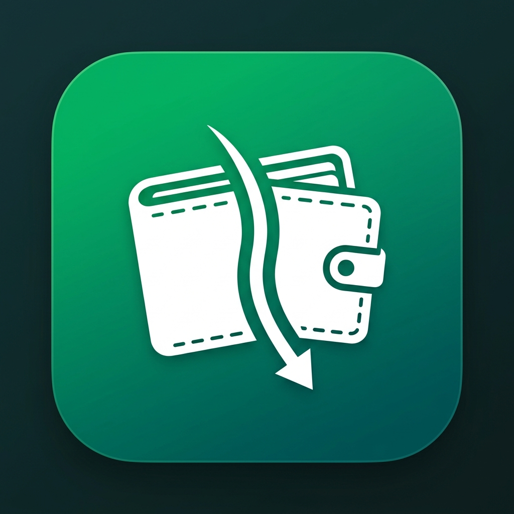

# 💸 SplitX

<div align="center">



### **Smart Expense Sharing, Bill Splitting & Group Settlements**

A modern, cross-platform financial application built with Flutter, Provider, Firebase Cloud Sync, FCM Notifications, and Hive local storage.

[](https://flutter.dev)
[](https://dart.dev)
[](https://firebase.google.com)
[](https://m3.material.io)
[](https://opensource.org/licenses/MIT)
[](https://github.com/ANKITDANDOTIYA/split_x/stargazers)

[Key Highlights](#-project-highlights) • [Features](#-features) • [Tech Stack](#-tech-stack) • [Folder Structure](#-folder-structure) • [Installation](#-installation) • [Firebase Setup](#-firebase-configuration) • [Deployment](#-deployment) • [License](#-license)

</div>

---

## 🌟 Project Highlights

- ⚡ **Offline-First Hybrid Sync Architecture**: Instant local reads/writes powered by **Hive**, seamlessly backed up to **Cloud Firestore** in real-time.
- 🔔 **Real-Time Push Notifications**: Powered by **Firebase Cloud Messaging (FCM)** and Google OAuth2 v1 HTTP API (`NotificationService`) to send instant activity notifications.
- 📱 **Pixel-Perfect Multi-Platform Experience**: Mobile-first design for Android and iOS, with an expanded multi-column layout for Flutter Web & Desktop viewports (`width >= 900px`).
- 📊 **Interactive Analytics Dashboard**: Beautiful financial analytics built with **`fl_chart`**, featuring spending breakdown charts, top spenders, peak spending days, and daily averages.
- 🤝 **Smart Settlement Engine**: Calculates exact minimum payment paths between participants to settle debts effortlessly.
- 🎨 **Adaptive Material Design 3 Theme**: Full Dark and Light mode support with curated emerald green fintech palette and dynamic Google Fonts (`Outfit`).

---

## 📱 Screenshots

> [!NOTE]
> Replace the placeholder image URLs below with your repository's actual screenshots.

| Home / Groups List | Expense View | Analytics Dashboard |
| :---: | :---: | :---: |
|  |  |  |

| Settlement View | Profile & Settings | Dark Mode |
| :---: | :---: | :---: |
|  |  |  |

---

## ✨ Features

### 🔐 Authentication & Security
- **Email & Password Authentication**: Powered by Firebase Auth.
- **Email Verification Guard**: Verified email requirement before account access (`VerifyEmailScreen`).
- **Password Reset Flow**: Self-service password recovery email trigger (`ForgotPasswordScreen`).

### 🔔 Push Notifications & Messaging
- **Firebase Cloud Messaging (FCM)**: Real-time background & foreground push notification alerts (`firebase_messaging`).
- **Google OAuth2 Service Account Integration**: Direct HTTP v1 API integration for triggering group expense alerts (`googleapis_auth` & `notification_service.dart`).

### 👥 Group & Member Management
- **Custom Expense Groups**: Create, view, and manage multi-member groups.
- **Contact Book Integration**: Import participants directly from phone contacts via `flutter_contacts` and `permission_handler`.
- **Manual Participant Addition**: Add members via email or name without requiring device contacts.

### 💰 Bill Splitting & Settle Up
- **Equal & Custom Bill Splitting**: Split expenses evenly or allocate exact custom amounts per participant.
- **Categorized Expenses**: Tag expenses with icons and categories (Food, Travel, Shopping, Bills, etc.).
- **Settle Up Bottom Sheet**: Record partial or full debt settlements between group members.
- **Settlement History**: Full log of historical payments and balances.

### 📊 Smart Financial Analytics
- **Spending Distribution Charts**: Visual pie charts and line charts using `fl_chart`.
- **Peak Day & Daily Average Calculation**: Instant insight into peak spending dates and daily expenditure rates.
- **Highest Spender & Largest Expense Highlights**: Automatically surfaced key metrics.

### 🎨 Customization & Responsive Web
- **System / Dark / Light Theme Switching**: Instant theme toggle stored in local preferences.
- **Responsive Web & Desktop Layout**: Dedicated multi-column GridView, desktop scaling, hover states, and maximum container widths for web viewports (`>= 900px`).

---

## 🛠️ Tech Stack

| Domain | Technology / Package | Description |
| :--- | :--- | :--- |
| **Framework** | [Flutter](https://flutter.dev) (v3.8+) | Cross-platform UI Toolkit |
| **Language** | [Dart](https://dart.dev) (v3.8+) | Object-oriented client-optimized language |
| **State Management** | [Provider](https://pub.dev/packages/provider) | Pragmatic state management & DI |
| **Backend & Messaging** | [Firebase Auth](https://pub.dev/packages/firebase_auth), [Cloud Firestore](https://pub.dev/packages/cloud_firestore) & [FCM](https://pub.dev/packages/firebase_messaging) | Authentication, Cloud Database & Push Notifications |
| **OAuth2 & HTTP** | [googleapis_auth](https://pub.dev/packages/googleapis_auth) & [http](https://pub.dev/packages/http) | Google HTTP v1 API OAuth2 authentication |
| **Local Storage** | [Hive](https://pub.dev/packages/hive) & [Hive Flutter](https://pub.dev/packages/hive_flutter) | Fast, offline NoSQL key-value database |
| **Charts** | [fl_chart](https://pub.dev/packages/fl_chart) | Highly customizable Flutter chart library |
| **Contacts & Rights** | [flutter_contacts](https://pub.dev/packages/flutter_contacts) & [permission_handler](https://pub.dev/packages/permission_handler) | Native contact access & permission management |
| **Typography** | [Google Fonts](https://pub.dev/packages/google_fonts) | Custom Google Fonts (`Outfit`) |

---

## 📂 Folder Structure

```
split_expenses/
├── assets/
│   ├── images/
│   │   └── app_logo.png             # Master SplitX logo asset
│   └── service-account.json         # Google OAuth2 FCM service account credentials
├── android/                         # Android native project configuration
├── ios/                             # iOS native project configuration
├── web/                             # Web configuration, index.html & icons
│   ├── favicon.png
│   ├── index.html
│   ├── manifest.json
│   └── icons/
├── lib/
│   ├── firebase_options.dart        # Auto-generated Firebase CLI configuration
│   ├── main.dart                    # Application entrypoint & AuthWrapper
│   ├── models/                      # Hive & Firestore data models
│   │   ├── expense.dart
│   │   ├── group.dart
│   │   ├── participant.dart
│   │   └── settlement.dart
│   ├── providers/                   # State Providers
│   │   ├── profile_provider.dart
│   │   └── theme_provider.dart
│   ├── screens/                     # UI Screen Views
│   │   ├── add_expense_screen.dart
│   │   ├── analytics_screen.dart
│   │   ├── expense_detail_screen.dart
│   │   ├── forgot_password_screen.dart
│   │   ├── group_detail_screen.dart
│   │   ├── group_list_screen.dart
│   │   ├── login_screen.dart
│   │   ├── profile_screen.dart
│   │   ├── register_screen.dart
│   │   ├── summary_screen.dart
│   │   └── verify_email_screen.dart
│   ├── services/                    # Business & Storage Service Layer
│   │   ├── auth_service.dart
│   │   ├── contact_service.dart
│   │   ├── firebase_service.dart
│   │   ├── firestore_service.dart
│   │   ├── group_service.dart
│   │   ├── notification_service.dart# FCM Push Notification Service (v1 API)
│   │   └── theme_service.dart
│   ├── storage/                     # Hive NoSQL persistence
│   │   └── storage_service.dart
│   ├── theme/                       # AppTheme light & dark themes
│   │   └── app_theme.dart
│   └── widgets/                     # Reusable UI Widgets & Dialogs
│       ├── add_participant_dialog.dart
│       ├── category_helper.dart
│       ├── expense_tile.dart
│       ├── responsive_center.dart
│       ├── settle_up_bottom_sheet.dart
│       └── settlement_history_tile.dart
├── pubspec.yaml                     # Dependencies & asset declarations
└── README.md
```

---

## ⚡ Installation

### Prerequisites
- [Flutter SDK](https://flutter.dev/docs/get-started/install) (`>= 3.8.1`)
- [Dart SDK](https://dart.dev/get-dart) (`>= 3.8.1`)
- Android Studio / VS Code with Flutter extension
- Firebase Project setup

### Steps

1. **Clone the Repository**
   ```bash
   git clone https://github.com/ANKITDANDOTIYA/split_x.git
   cd split_x
   ```

2. **Install Dependencies**
   ```bash
   flutter pub get
   ```

3. **Generate Hive Code Adapters**
   ```bash
   flutter pub run build_runner build --delete-conflicting-outputs
   ```

4. **Run Locally**
   ```bash
   flutter run
   ```

---

## 🔥 Firebase Configuration

This app uses Firebase for Authentication, Cloud Firestore, Cloud Messaging (FCM), and Hosting.

1. **Create a Firebase Project** at [Firebase Console](https://console.firebase.google.com/).
2. Enable **Email/Password** under Authentication -> Sign-in method.
3. Enable **Cloud Firestore Database** in production mode.
4. Enable **Cloud Messaging (FCM)** in project settings.
5. Run FlutterFire CLI inside the project directory:
   ```bash
   flutterfire configure
   ```
   This updates `lib/firebase_options.dart` automatically.

---

## 🚀 Running & Building

### Run Commands

```bash
# Run on connected mobile device or emulator
flutter run

# Run on Google Chrome (Web)
flutter run -d chrome
```

### Production Build Commands

```bash
# Build Android APK
flutter build apk --release

# Build Android App Bundle
flutter build appbundle --release

# Build Flutter Web Production Bundle
flutter build web --release
```

---

## 🌐 Deployment (Firebase Hosting)

Deploy the Web application to Firebase Hosting:

```bash
# Initialize Firebase Hosting in project root
firebase init hosting

# Build Web distribution files
flutter build web --release

# Deploy to live production URL
firebase deploy --only hosting
```

---

## 🏛️ Project Architecture

SplitX follows a clean **Service-Provider (MVVM)** architecture pattern:

```
[ UI Screens / Views ]
         │
         ▼
[ Providers & ChangeNotifiers ] (State Management)
         │
         ▼
[ Services Layer ] (AuthService, GroupService, FirestoreService, NotificationService)
    ┌────┼──────────────────────────┬────────────────────────┐
    ▼    ▼                          ▼                        ▼
[ Hive Local DB ]          [ Cloud Firestore ]       [ Firebase Messaging (FCM) ]
 (Offline Persistence)       (Real-time Sync)             (Push Notifications)
```

---

## 📐 Responsive Support Matrix

| Platform | Support Level | Layout Adaptation |
| :--- | :---: | :--- |
| **Android** | ✅ Native | Standard single-column mobile presentation |
| **iOS** | ✅ Native | Native iOS gestures, navigation & modal sheets |
| **Flutter Web** | ✅ Web Production | Responsive max-width containers & multi-column grids (`width >= 900px`) |
| **Desktop** | ✅ Windows/macOS/Linux | Constrained width center containers with mouse hover feedback |

---

## 🚀 Future Improvements

- [ ] Multi-currency conversion rate integration.
- [ ] Receipt OCR image scanning for automated bill parsing.
- [ ] Export group settlement statements to PDF/CSV.
- [ ] In-app direct payment gateway integration.

---

## 🤝 Contributing

Contributions are welcome! Follow these steps:

1. Fork the project repository.
2. Create a feature branch (`git checkout -b feature/AmazingFeature`).
3. Commit your changes (`git commit -m 'Add AmazingFeature'`).
4. Push to the branch (`git push origin feature/AmazingFeature`).
5. Open a Pull Request.

---

## 📄 License

Distributed under the **MIT License**. See `LICENSE` for details.

---

## 👨‍💻 Author

**Ankit Dandotiya**
- GitHub: [@ANKITDANDOTIYA](https://github.com/ANKITDANDOTIYA)

---

## 🌐 Live Demo & Downloads

- 🌐 **Live Web App**: [https://split-x.web.app](https://split-expenses-70f9a.web.app/)
- 🤖 **Download Android APK**: [GitHub Releases Page](https://github.com/ANKITDANDOTIYA/split_x/releases)

---

<div align="center">

**If you like this project, please give it a ⭐️ on GitHub!**

</div>
